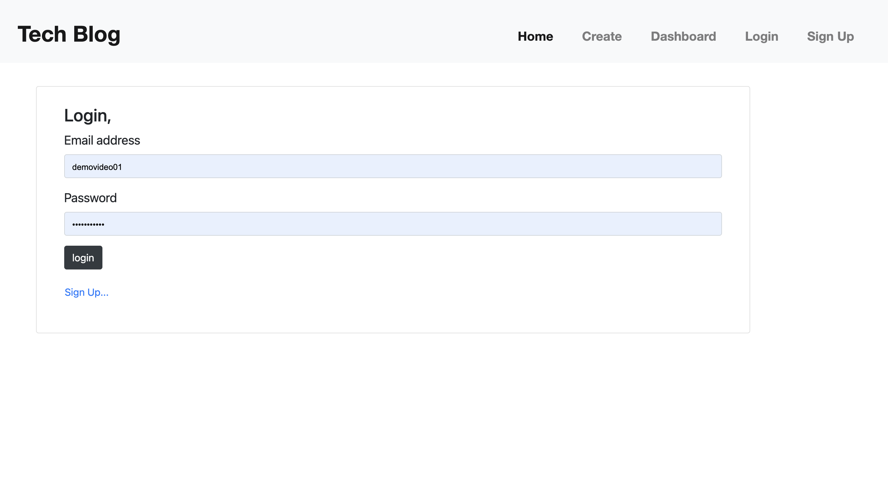
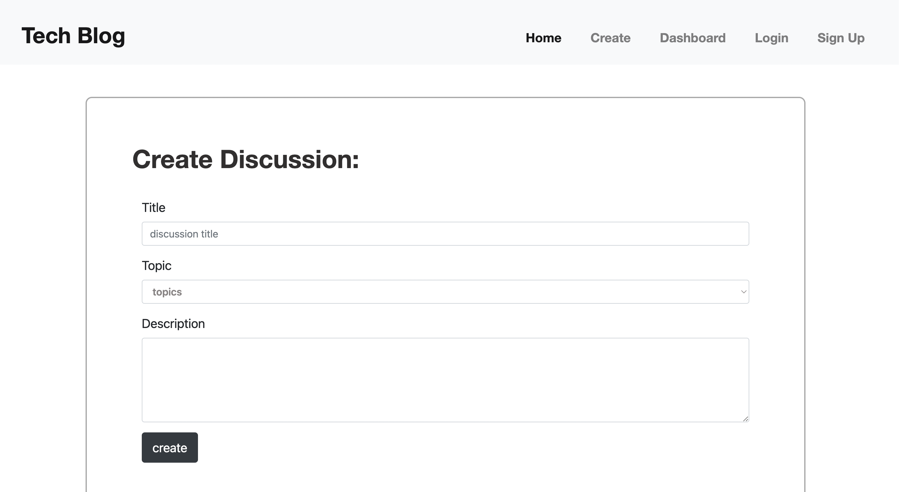
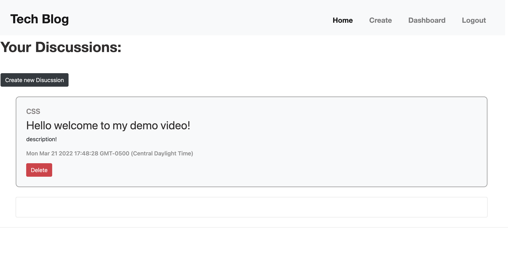

***NOTE TO GRADER: heroku link is not functioning properly, so I provided a demo think in my submission to display functionality of code***
# MVC (Model-View-Controller) Blog
[](https://opensource.org/licenses/)
#### **Name:** Honore Nelson 
#### **Deployed Link:** https://techblogbootcamp.herokuapp.com/
#### **Github Repo:** https://github.com/matisses-goldfish/blog
---
    
##  Table of Contents:
* [Description](#description)
* [Walkthrough](#walkthrough)
* [Application](#application)
* [Technologies Used](#technologies-used)
* [Usage Information](#usage)
* [Contribution Guidelines](#contribution-guidelines)
* [Authors](#authors)
* [License](#license)
* [Question](#questions)


## Description:
---
Writing about tech can be just as important as making it. Developers spend plenty of time creating new applications and debugging existing codebases, but most developers also spend at least some of their time reading and writing about technical concepts, recent advancements, and new technologies.

My task was to build a CMS-style blog site similar to a Wordpress site, where developers can publish their blog posts and comment on other developers’ posts as well. You’ll build this site completely from scratch and deploy it to Heroku. Your app will follow the MVC paradigm in its architectural structure, using Handlebars.js as the templating language, Sequelize as the ORM, and the express-session npm package for authentication.

## Walkthrough:
---
### Click the img to begin the video- 
[](https://www.youtube.com/watch?v=rTw8SXJeWIk)

## Application:
---
### Homepage-


### Sign Up-


### Login In-


### Create Post-


### Login Dashboard-



    
## Completed Criteria:
---
```md
GIVEN a CMS-style blog site
WHEN I visit the site for the first time
THEN I am presented with the homepage, which includes existing blog posts if any have been posted; navigation links for the homepage and the dashboard; and the option to log in
WHEN I click on the homepage option
THEN I am taken to the homepage
WHEN I click on any other links in the navigation
THEN I am prompted to either sign up or sign in
WHEN I choose to sign up
THEN I am prompted to create a username and password
WHEN I revisit the site at a later time and choose to sign in
THEN I am prompted to enter my username and password
WHEN I am signed in to the site
THEN I see navigation links for the homepage, the dashboard, and the option to log out
WHEN I click on the homepage option in the navigation
THEN I am taken to the homepage and presented with existing blog posts that include the post title and the date created
WHEN I click on the dashboard option in the navigation
THEN I am taken to the dashboard and presented with any blog posts I have already created and the option to add a new blog post
WHEN I click on the button to add a new blog post
THEN I am prompted to enter both a title and contents for my blog post
WHEN I click on the logout option in the navigation
THEN I am signed out of the site
WHEN I click on the sign-up button
THEN my user credentials are saved and I am logged into the site
WHEN I click on an existing blog post
THEN I am presented with the post title, contents, post creator’s username, and date created for that post and have the option to leave a comment
WHEN I am idle on the site for more than a set time
THEN I am able to view comments but I am prompted to log in again before I can add, update, or delete comments
WHEN I click on the button to create a new blog post
THEN the title and contents of my post are saved and I am taken back to an updated dashboard with my new blog post
```

## Future Development:
---
```md

WHEN I click on one of my existing posts in the dashboard
THEN I am able to delete my post and taken back to an updated dashboard

WHEN I enter a comment and click on the submit button while signed in
THEN the comment is saved and the post is updated to display the comment, the comment creator’s username, and the date created

WHEN I click on one of my existing posts in the dashboard
THEN I am able to update my post and taken back to an updated dashboard
```

## Technologies Used:
---
- **Bcrypt:** encripting user passwords to prevent hacking
- **Dotenv:** loads environment varriables from our .env file to a process.env
- **Express:** Backend framework for node.js
- **Express-Handlebars:** View client-side data within our handlabars
- **Express-Session:** The application of cookies, and tracking of client-side login status
- **Find-Config:** 
- **MySQL2:** Database and storge of client-side information
- **nodemon:** Automatically launching our server.js to test funcationality of our application
- **materalize:** Create a clean and consise user interface

## Usage:
---
Begin the application by opening the link provided (), Create an account, and login! Want to add to this discussion? simply fill out the discussion form to ask a question about anything tech related!
     
    
## Contribution Guidelines:
---
Contribute to this project using the Github work flow model!

    
## Authors
---
* **Honore Nelson** - *Initial work* - [blog](https://github.com/matisses-goldfish/blog)
    
## License
---

This project is licensed under the MIT License - see the [LICENSE.md](LICENSE.md) file for details
<br></br>

## Question
---
Any additional question? Reach out via Github!
* Honore Nelson: https://github.com/matisses-goldfish